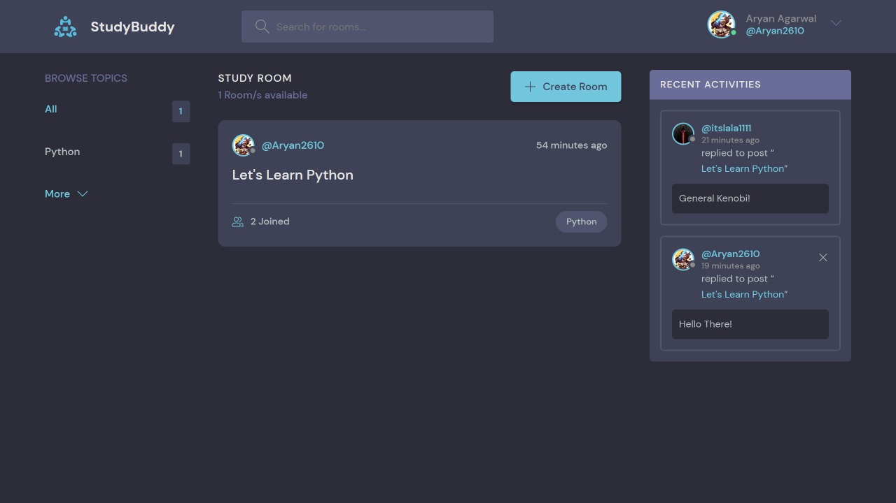

## Table of contents

- [Overview](#overview)
  - [Tutorial](#tutorial)
  - [Screenshot](#screenshot)
  - [Built with](#built-with)
- [Author](#author)

## Overview

App that provides a discussion platform on various topics especially study related.

### Tutorial

--> Create a virtual environment :

```bash

pip install virtualenv


virtualenv envname

```

--> Activate the virtual environment :

```bash
envname\scripts\activate

```

--> Install the requirements :

```bash
pip install -r requirements.txt

```

#

### Running the App

--> To run the App, we use :

```bash
python manage.py runserver

```

> ⚠ Then, the development server will be started at http://127.0.0.1:8000/

### SuperUser

superuser details:
email: user@gmail.com
password: admin123

### Screenshot



### Built with

Python Django

## Author

Aryan Agarwal
learned from and template by - https://www.udemy.com/user/dennis-ivanov-5/
